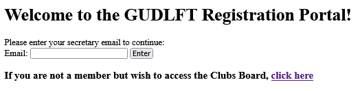
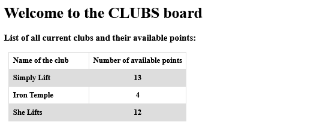
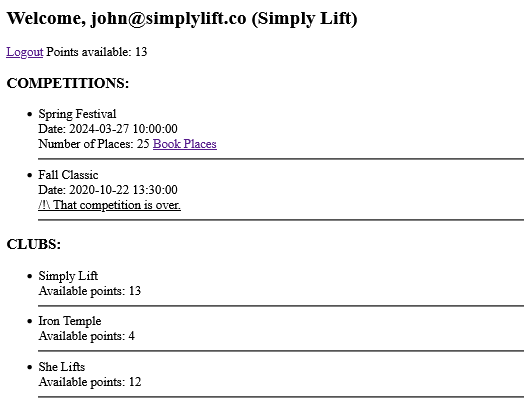
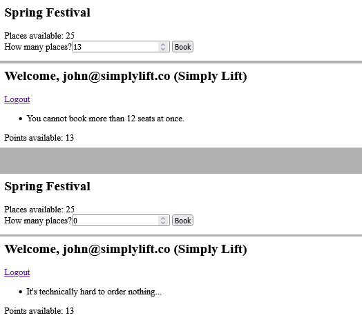
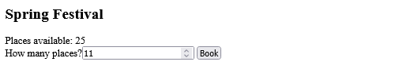
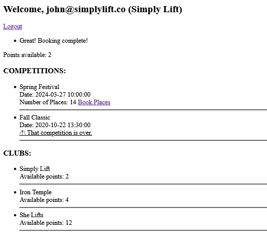

# ABOUT

**OpenClassrooms - Développeur d'application Python - Projet #11: Improve an app thorugh tests and debugging**

_Tested with Windows 10 and Python 3.10.2_

# Hao2do (Windows)
## Retrieving a copy of the "depository"

- `git clone https://github.com/munchou/OpenClassrooms-Project-11.git`

or download the ZIP file and extract it in a chosen folder.

## Creating and activating the virtual environment
(Python must have been installed)
- `cd OpenClassrooms-Project-11` (or any folder where the project is located)
- `python -m venv ENV` where ENV is the name of the folder where the environment will be created.
- Activation : `env/Scripts/activate`
    

## Installing the needed modules

- `pip install -r requirements.txt`

## Starting the program
You must tell flask where to the current application. For powershell, use that command:
`$env:FLASK_APP = "server.py"`

then `flask run`

For Bash:
`$ export FLASK_APP=hello`
`$ flask run`

For Fish:
`$ set -x FLASK_APP hello`
`$ flask run`

For CMD:
`> set FLASK_APP=hello`
`> flask run`

## Getting to the application
In any browser, type either addresses:
http://127.0.0.1:5000/ or http://localhost:5000/
They both allow to access the app.

## Some (cool) stuff to do
Below is the main page. Members can connect, but it is also possible to visitors to have access to the Clubs Board by clicling the link, where anyone can see the clubs and their respective available points.

The Clubs Board:

Entering a wrong email will redirect to the same welcome page (no visible changes for the user).
Once a user is connected, they will be redirected to their main page. That page displays the scheduled as well as the past competitions. There is also the list of all the clubs. The user can book seats from competitions.

A competition page with some examples of what happens if the input is not as expected (too many booked seats, entering 0, etc.)

Now, let's book some seats as any normal individual would:

Voilà! You can notice that not only has the booking been confirmed, but the club's available points as well as the available seats in the target competition have been updated.

P.S.: Sam, you are absolutely not fit to be a developer, I expect your resignation letter by next Monday. è_é