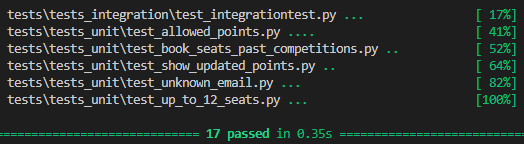
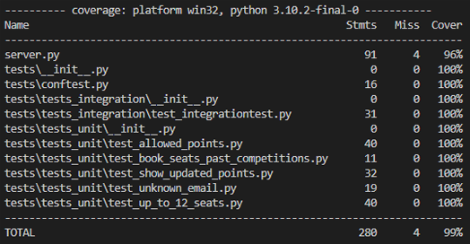
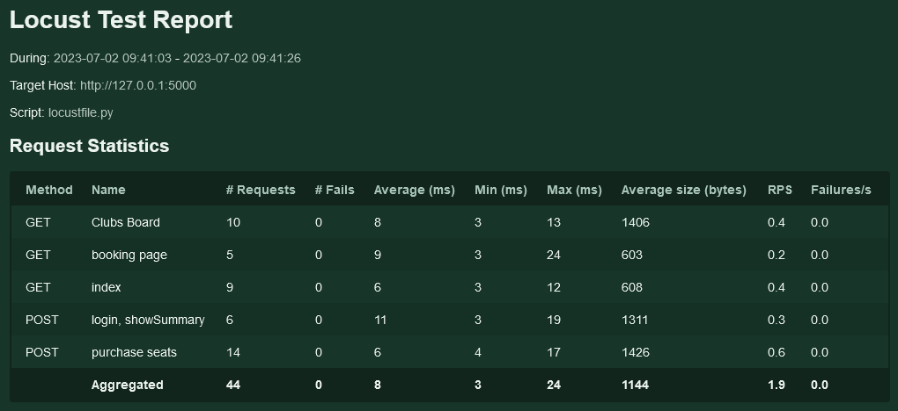

# ABOUT

**OpenClassrooms - Développeur d'application Python - Projet #11: Improve an app thorugh tests and debugging**

_Tested with Windows 10 and Python 3.10.2_

# Hao2do (Windows)
## Retrieving a copy of the "depository"

- `git clone https://github.com/munchou/OpenClassrooms-Project-11.git`

or download the ZIP file and extract it in a chosen folder.

## Creating and activating the virtual environment
(Python must have been installed)
- `cd OpenClassrooms-Project-11` (or any folder where the project is located)
- `python -m venv ENV` where ENV is the name of the folder where the environment will be created.
- Activation : `env/Scripts/activate`
    

## Installing the needed modules

- `pip install -r requirements.txt`

## Starting the program
You must tell flask where to get the current application from. For powershell, use that command:
`$env:FLASK_APP = "server.py"`

then `flask run`

For Bash:
`$ export FLASK_APP=server`
`$ flask run`

For Fish:
`$ set -x FLASK_APP server`
`$ flask run`

For CMD:
`> set FLASK_APP=server`
`> flask run`

## Getting to the application
In any browser, type either addresses:
http://127.0.0.1:5000/ or http://localhost:5000/
They both allow to access the app.

## Some (cool) stuff to do
Below is the main page. Members can connect, but it is also possible to visitors to have access to the Clubs Board by clicling the link, where anyone can see the clubs and their respective available points.

The Clubs Board:

Entering a wrong email will redirect to the same welcome page (no visible changes for the user).
Once a user is connected, they will be redirected to their main page. That page displays the scheduled as well as the past competitions. There is also the list of all the clubs. The user can book seats from competitions.

A competition page with some examples of what happens if the input is not as expected (too many booked seats, entering 0, etc.)

Now, let's book some seats as any normal individual would:

Voilà! You can notice that not only has the booking been confirmed, but the club's available points as well as the available seats in the target competition have been updated.

## Testing process
- ### Unit and integration tests
The test were run using pytest.
You simply need to type `pytest` and let the magic do its deed (to get more details about the tests, you can type `pytest -v`).
If the terminal displays any red, it's NOT normal!
Here's what you should expect:

- ### Unit and integration tests coverage
You can either type `pytest --cov` to get a quick result:

Or get an HTML output by using `coverage html`, which is pretty much the same as the above one:

.png)

- ### Performance test
The Locust module (v7.2.7) was used to run performance test.
To do so, you must:
1) Run your app server (very important! or else it won't work)
2) Run Locust by simply typing `locust` in your terminal. If it tells you that it couldn't find the lucstfile.py file, type `locust -f tests/performance_tests/locustfile.py`.
3) Your terminal will show you that you can access Locust through http://0.0.0.0:8089. If your browser doesn't allow you to connect to that address, try  http://localhost:8089.
4) The host address must be your app's server's, in that case http://127.0.0.1:5000.

- ### Reports
I totally understand you wouldn't want to run all those tedious tests. Which is why I prepared you some screenshots. As friendly as Peter Parker!

- Coverage (same as above):

.png)

- Locust report (note that I stopped the test once 6 users were connected):

You can also get the [HTML report here](tests/reports/locust_report_1688290965.864094.html)

There you gooo, that's it for that projet, cheers!

P.S.: Sam, you are absolutely not fit to be a developer, I expect your resignation letter by next Monday. è_é

P.P.S.: big thanks to Corentin and Arnadu! <3